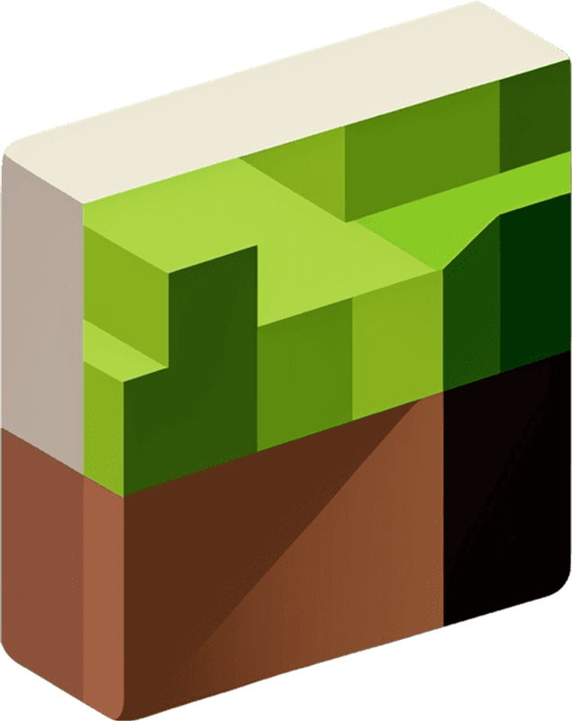

<h1 align="center">
    
    <br>
    <p>Kubek</p>
</h1>
<h3 align="center">Web Minecraft server dashboard, written on Node.js using MDBootstrap</h3>
<div align="center">
    <a href="#features">Features</a>
    •
    <a href="#installation">Installation</a>
</div>

## Kubek - Web Minecraft servers dashboard, written on Node.js using MDBootstrap

# Features:
- Linux and Windows supported
- Pure Web UI with dark and light themes
- Plugins and mods manager
- Real-time console
- `server.properties` editor
- FTP server included
- Web file manager
- Users and roles system
- Integration with Telegram bots

## Tested and working cores:
- All popular PaperMC versions and all PaperMC forks (Tuinity, Airplane, Purpur, etc.) will likely work too
- Spigot 1.8 - 1.18.2 (not included all versions)
- Forge 1.12.2 - 1.19.2 (not included all versions)
- Velocity 1.19.3

## Not tested/not working properly/not supported cores:
- BungeeCord (_working with problems_)
- TCauldron/Magma and other hybrid cores (_not tested_)

## Natively supported cores:
- PaperMC
- Spigot
- CraftBukkit
- Forge (upload installer)

# Installation

Download and launch [latest release](https://github.com/Seeroy/kubek-minecraft-dashboard/releases/latest)

**OR**

Clone repository and install modules
**Node.js >= 16 required!**
```
git clone https://github.com/Seeroy/kubek-minecraft-dashboard.git
cd kubek-minecraft-dashboard
npm install
```

Start after installation
```
node app.js
```

# Used icons
Materials Symbols by Google

[Directory icons created by Arkinasi - Flaticon](https://www.flaticon.com/free-icons/directory)

[Files and folders icons created by Arkinasi - Flaticon](https://www.flaticon.com/free-icons/files-and-folders)

[Gallery icons created by Arkinasi - Flaticon](https://www.flaticon.com/free-icons/gallery)

[Modify icons created by Arkinasi - Flaticon](https://www.flaticon.com/free-icons/modify)

[Delete icons created by Arkinasi - Flaticon](https://www.flaticon.com/free-icons/delete)

[Ui icons created by Arkinasi - Flaticon](https://www.flaticon.com/free-icons/ui)

[Log icons created by Arkinasi - Flaticon](https://www.flaticon.com/free-icons/log)
